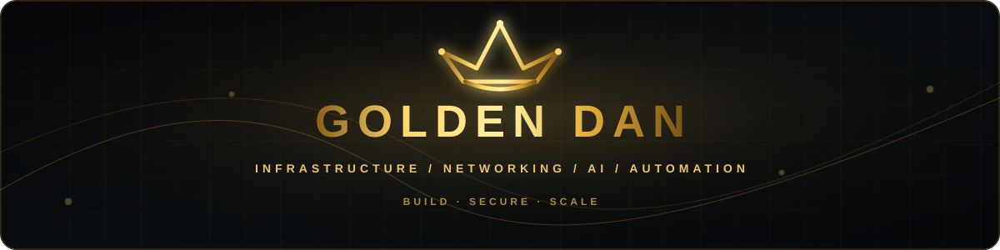
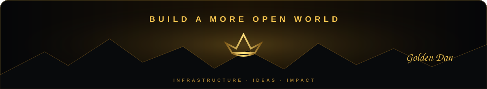

<div align="center">



<br/>


<br/>

[](https://t.me/goldendanoff)
[](https://vpngold.ru)
[](https://github.com/GoldenDanOFF)

</div>

---

## 👑 About Me

<table>
<tr>
<td width="65%" valign="top">

**Founder & Infrastructure Engineer** focused on networking, automation and AI-powered operations.

I build and operate **VPNGOLD**, design resilient network infrastructure, automate repetitive operations end to end, and experiment with AI agents that can work alongside real production systems.

> **Technology should give people more freedom, not less.**

</td>
<td width="35%" valign="top">

**Focus** — Infrastructure & AI  
**Building** — VPNGOLD  
**Learning** — Always  
**Goal** — More freedom online

</td>
</tr>
</table>

### ⚡ What I work on

<table>
<tr>
<td align="center" width="25%"><b>🌐 Networking</b><br/><sub>Xray · VLESS · REALITY<br/>routing · anti-DPI</sub></td>
<td align="center" width="25%"><b>🖥️ Infrastructure</b><br/><sub>Linux · Docker · Nginx<br/>monitoring · recovery</sub></td>
<td align="center" width="25%"><b>⚙️ Automation</b><br/><sub>Python · APIs · CI/CD<br/>bots · operations</sub></td>
<td align="center" width="25%"><b>🧠 AI Systems</b><br/><sub>LLMs · agents · orchestration<br/>analysis · tooling</sub></td>
</tr>
</table>

---

## 🛠️ Tech Stack

<div align="center">

### Network & Systems


### Backend & Data


### DevOps & Automation


### AI & Agentic Workflows


</div>

---

## 📊 GitHub Activity

<div align="center">


<br/>


</div>

---

## 🚀 What I'm Building

| | Project / Direction | What it means |
|:--:|---|---|
| 🛰️ | **VPNGOLD** | Resilient VPN infrastructure, routing and service automation |
| 🤖 | **AI Agent Systems** | Multi-model workflows for engineering, research and operations |
| 🧱 | **Infrastructure Automation** | Reproducible provisioning, monitoring, recovery and operational tooling |
| 💬 | **Telegram Automation** | Bots, subscriptions, payments, support and internal workflows |

---

## 📌 Featured Work

<div align="center">

<a href="https://github.com/GoldenDanOFF/Monitoring_Bot">
  
</a>
<a href="https://github.com/GoldenDanOFF/simpleanalysis">
  
</a>

<a href="https://github.com/GoldenDanOFF/contract-control-is">
  
</a>

</div>

---

## 🔭 Current Direction

```text
network resilience  →  operational automation  →  AI-assisted infrastructure
```

- Making infrastructure **more reproducible and easier to recover**.
- Building better **observability and incident-response tooling**.
- Exploring where **AI agents are genuinely useful in production operations**.
- Turning repetitive business and engineering workflows into **automated systems**.

<br/>

<div align="center">



<br/>

**`GoldenDanOFF`** · Infrastructure · Networking · Automation · AI

</div>
